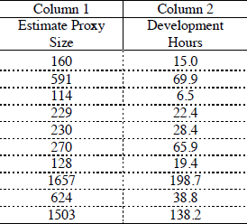
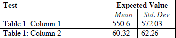

# Arquitecturas Empresariales - Laboratorio 1
En el Primer Laboratorio "Maven y GIT", se escribirá un programa para calcular la desviación estándar y media de un conjunto de n números reales. El programa debe realizar la lectura de los n números reales de un archivo de texto, el cual se debe utilizar una lista enlazada o Linkedlist para almacenar los n números para los respectivos cálculos. Para esto, se debe escribir una implementación propia de una lista enlazada y esta debe ser compatible con la API de colecciones de Java.
## Prerequisitos

Conocimientos basicos sobre media y desviación estandar de la muestra de una población, ademas de un lista doblemente encadenada

- Funciones
  - Calculo de la desviacion estandar.
  - Calculo de la media.


## Descarga de Repositorio

Para clonar este repositorio basta con copiar la siguiente linea en un Shell de cualquier sistema operativo

**“git clone https://github.com/Killersys/AREP-Lab1.git”**

## Instalación Herramientas de Repositorio

Es recomendable tener instalado maven en su computadora para poder visualizar de una mejor manera las pruebas y compilación del taller. para esto dirijase al pagina de maven y siga los pasos de instalación.

**https://maven.apache.org/install.html**


Una vez que tenga maven en su computadora, dirijase a la carpeta raiz del Laboratorio 1 y para compilar el proyecto se deber introducir el siguiente comando:

**mvn package**

Para poder ejecutar el programa introduce el siguiente comando

**java -cp target/taller-1-1.0-SNAPSHOT.jar edu.escuelaing.arep.app.App**

## DOCUMENTACIÓN
Para poder generar la Documentación del laboratorio es necesario escribir el siguiente comando en el Interprte de Comandos.
```
mvn javadoc:javadoc
```

## Pruebas  

Se muestran los dos ejemplos que estan en el pdf del taller 

Se usan los siguientes datos (prueba por cada columna)



Para cada columna se deberian obtener los siguientes resultados




## Código construido por medio de Herramienta

[Eclipse](https://www.eclipse.org/) plataforma de código abierto para el desarrollo de aplicaciones

## Autor

Jairo Pulido


## Licencia

GNU GENERAL PUBLIC LICENSE
